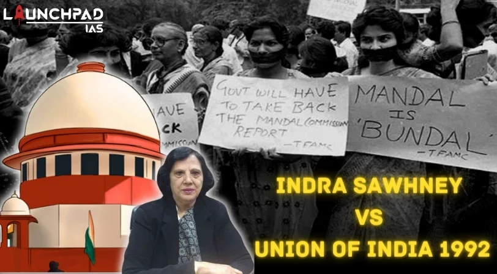
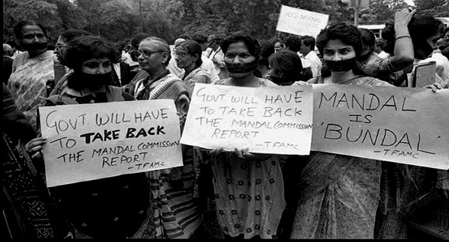

# Case Study: **Indra Sawhney vs Union of India (1992)**

The **Indra Sawhney vs Union of India** case, commonly known as the **Mandal Commission case**, is one of the most important constitutional cases in India. This landmark judgment, delivered by the Supreme Court in 1992, primarily addresses the **interpretation of the term 'State'** under **Article 12** of the Indian Constitution and the implementation of **reservation policies** for **Other Backward Classes (OBCs)** in government jobs and educational institutions.

## 📜 **History and Background of the Case**

In 1990, the **Government of India** decided to implement the **recommendations of the Mandal Commission**, which suggested **27% reservation** for **Other Backward Classes (OBCs)** in government jobs and educational institutions. This move sparked widespread protests and legal challenges, leading to the **Indra Sawhney** case being filed in the **Supreme Court**.

### **Key Issues Raised in the Case**
1. **Reservation and Fundamental Rights**:  
   Whether the reservation policy for OBCs violates fundamental rights guaranteed under **Articles 14, 15, and 16** (equality, non-discrimination, and equal opportunity).
2. **Interpretation of 'State' under Article 12**:  
   Whether the definition of 'State' should include authorities other than the central and state governments, such as local authorities and public institutions.

## ⚖️ **Key Judgments and Findings**

The **Supreme Court's judgment** in **Indra Sawhney vs Union of India** is historic for its interpretation of several constitutional provisions and its implications for **affirmative action** in India. The following are the crucial findings of the case:

1. **Interpretation of 'State' under Article 12**:  
   The Court ruled that the term **'State'** includes not only the **Union** and **State Governments** but also **local authorities** and **other public institutions** that are controlled by the government. This broad interpretation extended the reach of **fundamental rights** to cover a range of public authorities.

2. **Upholding the Reservation Policy**:  
   The Court upheld the **27% reservation** for **OBCs** in **government jobs and educational institutions**. It acknowledged the need for affirmative action to uplift socially and economically disadvantaged communities.

3. **50% Cap on Reservation**:  
   While affirming the reservation policy, the Court imposed a **cap of 50%** on the total reservations in government jobs and educational institutions to maintain a balance with **equality of opportunity** and to prevent **reverse discrimination**.

4. **No Reservation for Economically Backward Classes in General Category**:  
   The Court clarified that **economic status** alone cannot be the basis for reservations, emphasizing that reservations must be based on **social backwardness**.

5. **Affirmative Action and Fundamental Rights**:  
   The judgment reaffirmed that any reservation policy must be carefully scrutinized to ensure it does not violate the **basic structure of the Constitution** or infringe upon **fundamental rights**.

## 📑 **Connection with Constitutional Articles**

The **Indra Sawhney** case is intrinsically connected with several key provisions of the **Indian Constitution**:

### 1. **Article 12 – Definition of 'State'**
   The Court's ruling broadened the definition of 'State' under Article 12, which traditionally referred to the **Union and State Governments**. The expanded definition now includes **local authorities** and **public institutions**, ensuring they are bound by the same constitutional safeguards and **fundamental rights**.

### 2. **Articles 14, 15, and 16 – Fundamental Rights**
   - **Article 14** guarantees **equality before the law**.
   - **Article 15** prohibits **discrimination on the grounds of religion, race, caste, sex, or place of birth**.
   - **Article 16** ensures **equality of opportunity** in matters of public employment.
   
   The Court balanced these rights with the **reservation** policy for OBCs, emphasizing the need for affirmative action to promote social justice without violating the principle of **equality**.

### 3. **Article 46 – Promotion of Educational and Economic Interests of Weaker Sections**
   This **Directive Principle of State Policy** provides a basis for **affirmative action** aimed at promoting the interests of **backward classes**, aligning with the Court's support for the Mandal Commission's recommendations.

## 📝 **Impact and Importance of the Judgment**

The **Indra Sawhney** case holds immense significance for several reasons:

### 1. **Upheld Reservation for Backward Classes**
   The Court's **endorsement of the Mandal Commission's recommendations** helped ensure **representation and opportunities** for OBCs in public institutions, addressing historical social inequities.

### 2. **Expansion of 'State' to Public Institutions**
   The **interpretation of 'State'** in this case extended **fundamental rights** to public institutions, making them more accountable to constitutional principles.

### 3. **Reservation Ceiling**
   The **50% cap on reservations** became a guiding principle for implementing any reservation policy, ensuring it does not undermine the **fundamental rights** to equality.

### 4. **Affirmative Action within Constitutional Limits**
   The case struck a balance between **social justice** and **equality**, reinforcing the idea that affirmative action can be constitutional as long as it respects the **basic structure** of the Constitution.

## 🏛️ **Example of Application: Reservation in Public Employment and Education**

1. **Implementation of Mandal Commission's Recommendations**:  
   The case led to the **implementation of 27% reservation** for **OBCs** in **government jobs** and **educational institutions**, making a significant impact on the inclusion of marginalized communities in public life.

2. **Guiding Affirmative Action Policies**:  
   The judgment continues to guide **reservation policies** in India, particularly in the areas of **education** and **employment**, ensuring that the interests of the socially backward are safeguarded.

## 📷 **Images and Videos Related to the Case Study**
Here is an illustrative image, symbolizing the legal importance of this landmark case:

---

*This content is reproduced from [www.legislative.gov.in](https://www.legislative.gov.in). All rights reserved. Special thanks to the legislative department.*
