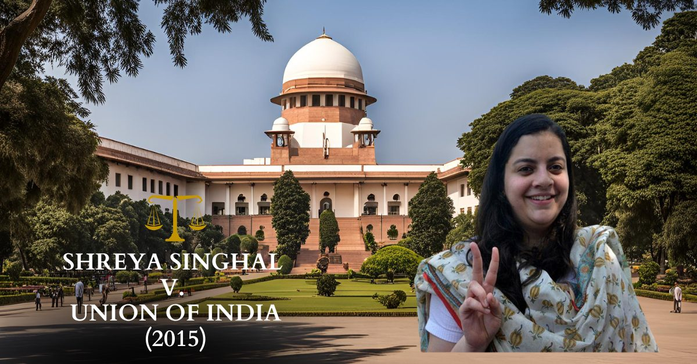
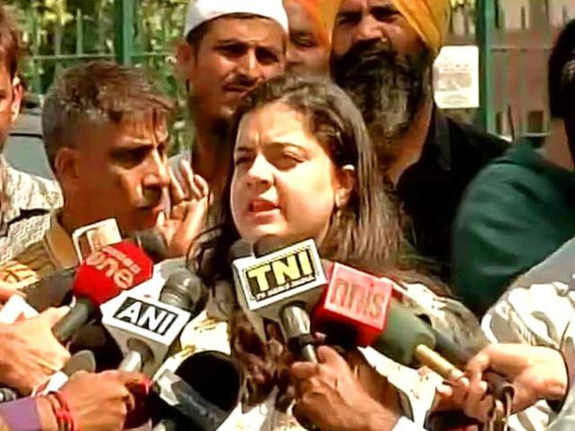

# Case Study: **Shreya Singhal vs Union of India (2015)**

## **Background**
In the case of **Shreya Singhal v. Union of India (2015)**, the Supreme Court of India struck down **Section 66A** of the **Information Technology Act, 2000** (IT Act), which had been used to criminalize online speech deemed offensive or inappropriate. This ruling was a significant step towards safeguarding **freedom of speech** in the digital era, upholding **Article 14** (Right to Equality) and **Article 19(1)(a)** (Freedom of Speech and Expression) of the Constitution of India.

### **Case History**
In 2012, a 21-year-old student named **Shreya Singhal** had filed a petition challenging Section 66A of the IT Act after it was used to arrest her friend for posting a comment on Facebook. The comment criticized a political party's shutdown in Mumbai, leading to the arrest under Section 66A, which criminalized the sending of offensive messages through communication services, websites, or applications.

Singhal's petition argued that the law was vague, overly broad, and violated the fundamental right to free speech guaranteed by the **Indian Constitution**. The law was challenged on the grounds that it lacked clear standards and could be used to target individuals expressing dissenting views or opinions.

### **Important Judgements**
On **March 24, 2015**, the **Supreme Court of India** delivered its judgment, striking down Section 66A. The court held that Section 66A was unconstitutional and violative of the **fundamental rights** guaranteed under **Article 19(1)(a)** (Freedom of Speech and Expression) of the Constitution.

Key points from the judgment:
1. **Vague and Overbroad Provisions**: The court found that the wording of Section 66A was too vague and could be easily misused to curb free speech.
2. **Infringement on Free Speech**: The court concluded that the law disproportionately limited the right to free speech, violating the fundamental rights guaranteed under **Article 19(1)(a)**.
3. **No Clear Standards**: The court noted that the law failed to provide clear definitions for what constituted "offensive" or "menacing" content, leading to arbitrariness and misuse by authorities.
4. **Striking Down Section 66A**: The court’s ruling made it clear that any law which imposes undue restrictions on free speech must meet the test of reasonableness, which Section 66A failed to pass.

### **Connection with Articles of the Constitution**
The case is directly related to the following Articles in the **Indian Constitution**:
- **Article 14** (Right to Equality): The ruling emphasized that any law that arbitrarily limits fundamental freedoms violates the right to equality, as it treats citizens unequally by restricting their freedom of speech without a justifiable reason.
- **Article 19(1)(a)** (Freedom of Speech and Expression): Section 66A was found to be in violation of this fundamental right, which guarantees all Indian citizens the right to express themselves freely, subject to reasonable restrictions.
- **Article 21** (Protection of Life and Personal Liberty): While the case primarily focused on freedom of speech, the broader implications of restricting individual liberty and autonomy were also considered by the court.

### **Impact and Significance**
This case is considered a landmark judgment in the context of **digital rights** and **freedom of expression** in India. By striking down Section 66A, the Supreme Court affirmed the importance of protecting the free flow of information and ideas in the digital age.

1. **Restoring Digital Freedom**: The ruling ensured that citizens would not be penalized for expressing themselves online, thus safeguarding the rights of internet users against arbitrary censorship.
2. **Setting Precedents**: The judgment served as a precedent in future cases involving online speech and digital rights, influencing how laws related to online content would be interpreted in India.
3. **Strengthening Democracy**: The decision upheld the democratic principle of free speech, ensuring that people could express dissenting views without fear of prosecution.

### **Visuals and Multimedia Related to the Case**
Below are placeholders for visuals or multimedia resources that can be added to the case study:

---

### Conclusion
The **Shreya Singhal v. Union of India (2015)** case is a landmark judgment in India's legal history, underscoring the importance of **freedom of speech and expression** in the digital age. By striking down Section 66A of the IT Act, the Supreme Court reinforced the fundamental right of individuals to express themselves freely, without fear of arbitrary state intervention.

---

*This content is based on the Supreme Court's judgment in the case of Shreya Singhal v. Union of India (2015). For further details, please refer to the official ruling.*  
