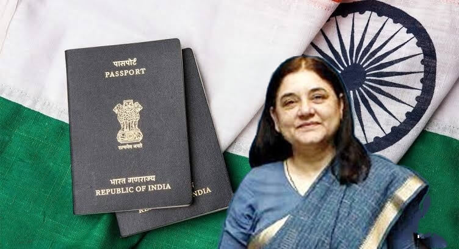

# Case Study: **Maneka Gandhi vs Union of India (1978)**

## **Background**
The **Maneka Gandhi vs Union of India (1978)** case is a landmark judgment in the history of the Indian Constitution that emphasized the significance of **personal liberty** and the **right to free speech and expression** under **Article 19(1)(a)**. This case revolutionized the interpretation of **Article 21** (Protection of Life and Personal Liberty) and its interplay with **Articles 14** and **19**.

The case arose when the Government of India impounded Maneka Gandhi’s passport in 1977 under the **Passport Act, 1967**, citing vague "public interest" reasons. Maneka Gandhi filed a writ petition challenging this decision, claiming it violated her **fundamental rights** under Articles 14, 19, and 21.

---

### **Case History**
1. **Context**: Maneka Gandhi, a journalist and social activist, was issued a passport in 1976. However, in 1977, the Regional Passport Officer in New Delhi, acting under Section 10(3)(c) of the Passport Act, asked her to surrender her passport without providing specific reasons, citing only "public interest."
   
2. **Legal Challenge**: Maneka Gandhi challenged this order in the Supreme Court, arguing that it violated her:
   - **Article 19(1)(a)**: Right to freedom of speech and expression.
   - **Article 19(1)(g)**: Right to practice any profession or occupation.
   - **Article 21**: Right to personal liberty.
   - **Article 14**: Right to equality before the law.

3. **Issues Raised**:
   - Can personal liberty under **Article 21** be curtailed arbitrarily?
   - Does the right to free speech and personal liberty extend to the right to travel abroad?
   - What is the scope of the phrase "procedure established by law" in Article 21?

---

### **Important Judgments**
On **January 25, 1978**, the **Supreme Court of India** delivered a transformative judgment in favor of Maneka Gandhi. The bench, comprising Chief Justice M.H. Beg and six other judges, expanded the scope of **fundamental rights** and laid down several key principles.

1. **Interconnection of Fundamental Rights**:
   - The court held that Articles 14, 19, and 21 are interconnected and not mutually exclusive. Any procedure depriving a person of life or liberty must pass the tests of **reasonableness** and **fairness** under **Article 14** and should not violate **Article 19**.

2. **Expanded Scope of Personal Liberty**:
   - The court redefined **personal liberty** under Article 21, holding that it encompasses the right to travel abroad. Any restriction must adhere to a **fair, just, and reasonable procedure**.

3. **Fair Procedure Doctrine**:
   - The court clarified that "procedure established by law" in Article 21 cannot be arbitrary or oppressive. It must satisfy the principles of **natural justice**.

4. **Freedom of Speech and Expression**:
   - The court acknowledged that freedom of speech under **Article 19(1)(a)** includes the right to communicate and exchange ideas internationally. Any restriction must be within the framework of **reasonable restrictions** under **Article 19(2)**.

---

### **Connection with Articles of the Constitution**
The case reaffirmed and expanded the interpretation of multiple Articles of the Indian Constitution:
- **Article 19(1)(a)**: Freedom of speech and expression was interpreted to include the right to travel abroad for communication and exchange of ideas.
- **Article 21**: Personal liberty was broadened to encompass fair legal procedures that protect individual autonomy and dignity.
- **Article 14**: Equality before the law was upheld, ensuring no arbitrary action by the State.
- **Article 19(1)(g)**: The right to practice any profession or occupation was also linked to international travel.

---

### **Impact and Significance**
The **Maneka Gandhi judgment** is one of the most cited cases in Indian constitutional law, with profound implications for the protection of fundamental rights:
1. **Strengthened Article 21**: The case transformed Article 21 into a repository of numerous rights, such as the right to privacy, education, and livelihood.
2. **Prevented Arbitrary State Action**: By linking Articles 14, 19, and 21, the judgment curtailed arbitrary powers of the State and ensured procedural safeguards.
3. **Global Recognition**: The ruling aligned Indian jurisprudence with global human rights standards, emphasizing the universal value of liberty.

---

---

### **Conclusion**
The **Maneka Gandhi vs Union of India (1978)** case marked a paradigm shift in Indian constitutional law. By expanding the scope of **personal liberty**, the Supreme Court ensured that arbitrary State action could no longer infringe upon individual freedoms without adhering to **fair, just, and reasonable procedures**. The judgment remains a cornerstone in protecting **fundamental rights** and upholding the **rule of law** in India.

---

*This content is based on the Supreme Court's judgment in the case of Maneka Gandhi vs Union of India (1978). For more details, refer to official court records.*  
