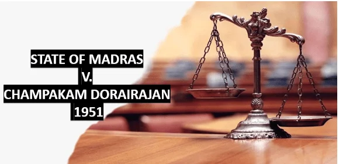

# **Case Study: State of Madras vs. Champakam Dorairajan (1951)**  
## **Article 46** – Directive Principles vs. Fundamental Rights  

## **Overview**  
The **State of Madras vs. Champakam Dorairajan (1951)** case is a landmark judgment in Indian constitutional history. It highlighted the conflict between the **Directive Principles of State Policy (DPSPs)** under **Article 46** and **Fundamental Rights**, particularly those ensuring equality.  

The Supreme Court ruled in favor of Fundamental Rights, asserting their primacy over DPSPs in case of conflict. This case was instrumental in shaping India’s approach to socio-economic policies within the bounds of constitutional guarantees.

---

## **Case History**  

### **Background**  
- **Petitioner**: Champakam Dorairajan, a resident of Madras, challenged the **Communal Government Order (G.O.)** issued by the State of Madras.  
- **Government Order**: The G.O. reserved seats in educational institutions for different communities based on caste and religion, aiming to promote the welfare of Scheduled Castes and other backward communities under **Article 46**.  

### **Key Issue**  
The case questioned:  
- **Can Directive Principles of State Policy override Fundamental Rights, especially the right to equality under Article 15(1)?**

---

## **Supreme Court Judgment**  

### **Key Highlights**  
1. **Primacy of Fundamental Rights**:  
   - The Court held that Fundamental Rights are sacrosanct and cannot be overridden by DPSPs.  
   - The Communal G.O. violated **Article 15(1)**, which prohibits discrimination based on religion, race, caste, sex, or place of birth.  

2. **Directive Principles as Guiding Principles**:  
   - **Article 46**, which directs the State to promote the educational and economic interests of weaker sections, cannot conflict with Fundamental Rights.  
   - DPSPs are non-justiciable and cannot be enforced in violation of Fundamental Rights.  

3. **Impact on Reservations**:  
   - This judgment led to the **First Amendment Act, 1951**, which introduced **Article 15(4)**, allowing the State to make special provisions for socially and educationally backward classes.  

---

## **Connection with Constitutional Articles**  

### **Article 46**  
- Enjoins the State to promote the educational and economic interests of weaker sections of society.  
- The judgment emphasized that this objective must align with Fundamental Rights.  

### **Article 15(1)**  
- Prohibits discrimination on specific grounds.  
- The Court upheld this article as paramount, ensuring equal treatment in educational opportunities.  

### **Article 15(4)**  
- Introduced via the **First Amendment Act**, it enables affirmative action to uplift backward classes without violating equality.  

---

## **Impact and Legacy**  

### **Strengthening Equality**  
This case reaffirmed the supremacy of **Fundamental Rights**, ensuring that equality and non-discrimination remain at the core of India's constitutional framework.  

### **Foundation for Affirmative Action**  
The judgment directly influenced the introduction of **Article 15(4)**, paving the way for affirmative action in education and employment.  

### **Balancing Rights and Policies**  
It established a judicial framework to balance the enforcement of DPSPs and Fundamental Rights, ensuring that social justice initiatives respect constitutional guarantees.  

---

---

## **Conclusion**  
The **State of Madras vs. Champakam Dorairajan (1951)** case marked a critical juncture in Indian constitutional law. By upholding the primacy of Fundamental Rights over Directive Principles, the judgment ensured that equality and individual freedoms remain the cornerstone of Indian democracy. It also laid the groundwork for future affirmative action policies under **Article 15(4)**.

*This content is based on the official judgment of the Supreme Court in the Champakam Dorairajan case (1951).*  
