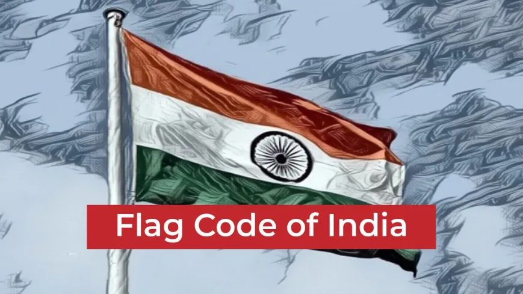

# Case Study: **The Flag Code of India**

## **Background**
The **Flag Code of India** provides a comprehensive set of rules governing the display, usage, and respect of the Indian national flag. It derives its authority from **Article 51A(b)** of the Constitution, which mandates every citizen of India to cherish and follow the ideals that inspired the national struggle for freedom and to respect the national flag.

The code consolidates all laws, conventions, practices, and instructions for the proper use of the national flag to ensure it is treated with dignity and respect.

---

### **Case History**
1. **Introduction of the Flag Code**:
   - The Flag Code of India came into effect on **January 26, 2002**.
   - It unified various provisions concerning the flag under one document and allowed ordinary citizens to hoist the tricolor on all days, ensuring adherence to proper respect and protocol.

2. **Historical Context**:
   - Before the adoption of the code, the use of the national flag by citizens was restricted to specific occasions, such as national holidays.
   - This restriction was challenged by industrialist **Naveen Jindal** in the landmark **Union of India v. Naveen Jindal (2004)** case, leading to significant reforms in flag usage laws.

---

### **Important Judgments**
#### **Union of India v. Naveen Jindal (2004)**:
- Naveen Jindal filed a petition asserting his right to fly the national flag under **Article 19(1)(a)**, which guarantees freedom of speech and expression.
- The Supreme Court ruled in favor of Jindal, stating that flying the national flag is an expression of individual patriotism and a fundamental right.

#### **Key Principles Established**:
1. **Fundamental Right to Display the Flag**:
   - The right to hoist the flag is an extension of the right to freedom of expression under Article 19(1)(a).
2. **Respect for the Flag**:
   - The judgment emphasized that while citizens have the right to display the flag, it must always be done respectfully and in accordance with the Flag Code.

---

### **Provisions of the Flag Code of India**
1. **Part I**: General description of the national flag.
   - The flag consists of three horizontal tricolors: saffron (top), white (middle, with Ashoka Chakra), and green (bottom).

2. **Part II**: Display of the flag by private and public organizations.
   - Citizens can hoist the flag at homes, offices, and educational institutions with proper respect.

3. **Part III**: Rules for government and military display.
   - Protocols for official ceremonies, national days, and half-mast usage.

---

### **Connection with Articles of the Constitution**
The Flag Code aligns with various constitutional provisions:
- **Article 51A(b)**: Encourages every citizen to respect the flag as part of their fundamental duties.
- **Article 19(1)(a)**: The right to fly the flag is linked to the freedom of expression.
- **Article 51A(a)**: Calls for upholding the sovereignty, unity, and integrity of India, symbolized by the flag.

---

### **Impact and Significance**
1. **Promoting Patriotism**:
   - The Flag Code fosters national pride by ensuring citizens understand the significance and sanctity of the tricolor.

2. **Legal Awareness**:
   - It educates people about the dos and don’ts regarding the flag's usage, preventing disrespect.

3. **Strengthening Civic Responsibility**:
   - Encourages citizens to actively engage in their fundamental duties, promoting unity and integrity.

---

---

### **Conclusion**
The **Flag Code of India** is a vital document that ensures the Indian national flag is treated with the respect and dignity it deserves. The reforms following the **Naveen Jindal case** have empowered citizens to express their patriotism while adhering to the guidelines of the Flag Code. Together with **Article 51A(b)**, it reminds citizens of their fundamental duty to respect national symbols, fostering a sense of unity and national pride.

---

*This content is based on the Flag Code of India and the judgment in Union of India v. Naveen Jindal (2004). For detailed guidelines, refer to the official Flag Code document.*  
