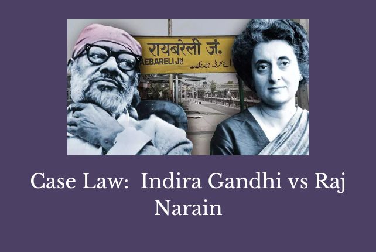
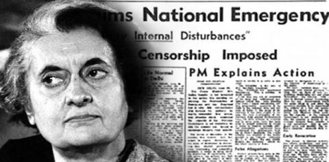

# **Case Study: Indira Nehru Gandhi v. Raj Narain (1975)**  
## **Article 51A(c)** – Protecting Sovereignty and Democratic Integrity  

## **Overview**  
The **Indira Nehru Gandhi v. Raj Narain (1975)** case stands as a milestone in India’s constitutional history. It scrutinized the power of Parliament under **Article 368** to amend the Constitution and its impact on the democratic process. The case also highlighted the fundamental duty under **Article 51A(c)** to uphold and protect the sovereignty and integrity of India by safeguarding democratic principles.  

This landmark judgment revolved around the allegations of electoral malpractice against then Prime Minister **Indira Gandhi** and the subsequent constitutional amendments that sought to insulate her position from judicial review.  

---

## **Case History**  

### **Background**  
- **Election Challenge (1971)**: **Raj Narain**, a political opponent of Indira Gandhi, contested her election from the **Rae Bareli constituency** and accused her of electoral malpractices.  
- **Allahabad High Court Verdict**: In **June 1975**, the court found Indira Gandhi guilty of corrupt practices, invalidating her election.  

### **Declaration of Emergency**  
Following the verdict, Indira Gandhi’s government declared a **National Emergency**, citing internal disturbances. During this period, the **39th Amendment to the Constitution** was passed, which sought to shield the Prime Minister's election from judicial scrutiny.  

---

## **Supreme Court Judgment**  

### **Key Highlights**  
1. **Basic Structure Doctrine**:  
   - Reiterating the **Kesavananda Bharati v. State of Kerala (1973)** precedent, the Court held that Parliament could not alter the **basic structure** of the Constitution, even under **Article 368**.  
   - Democracy and the rule of law were recognized as integral components of this doctrine.  

2. **Invalidation of the 39th Amendment**:  
   - The Court struck down provisions of the **39th Amendment**, which placed elections of key officials, including the Prime Minister, beyond judicial review.  
   - It ruled that such provisions undermined the basic structure of the Constitution.  

3. **Reaffirming Judicial Oversight**:  
   - The judgment emphasized the judiciary's role in maintaining democratic integrity by reviewing legislative and executive actions.  

---

## **Connection with Constitutional Articles**  

### **Article 51A(c)**  
- This article places a fundamental duty on citizens to uphold and protect India’s sovereignty, unity, and integrity.  
- The case underscored the importance of safeguarding democratic processes as a means to protect national unity and sovereignty.  

### **Article 368**  
- While granting Parliament the power to amend the Constitution, this article is subject to the **basic structure doctrine**, as reaffirmed in this case.  

---

## **Impact and Legacy**  

### **Strengthening Democracy**  
The case reaffirmed the principle that **free and fair elections** are the cornerstone of democracy. By invalidating amendments that undermined judicial review, the judgment upheld the sanctity of the democratic process.  

### **Limiting Parliamentary Power**  
The ruling curtailed Parliament's ability to amend the Constitution in a manner that distorts its fundamental values, thereby protecting the rule of law.  

### **Role of Fundamental Duties**  
The judgment reinforced the importance of **Article 51A(c)**, reminding citizens and leaders alike to prioritize democratic principles and constitutional values.  

---

---

## **Conclusion**  
The **Indira Nehru Gandhi v. Raj Narain (1975)** judgment remains a cornerstone of India’s constitutional evolution. It emphasized the judiciary’s role in preserving democracy and curbed legislative overreach through the **Basic Structure Doctrine**. This case serves as a powerful reminder of every citizen’s duty under **Article 51A(c)** to protect the sovereignty and integrity of India by respecting democratic principles and institutions.  

*This content is based on official constitutional records and the Supreme Court judgment in Indira Nehru Gandhi v. Raj Narain (1975).*  
